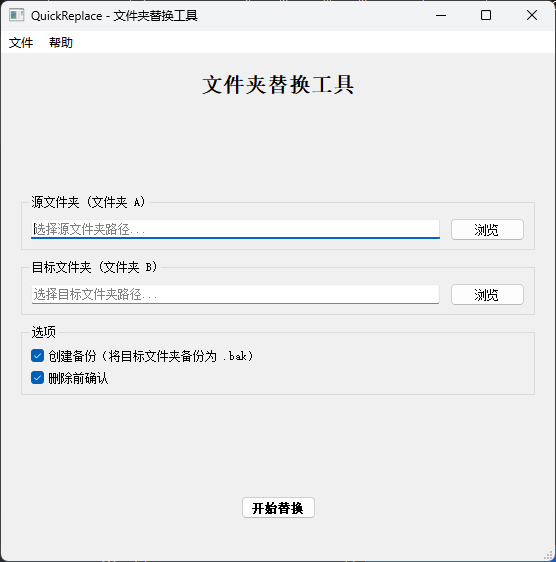

# QuickReplace

一个基于 Qt 的文件夹内容替换工具，允许用户快速将源文件夹的内容替换到目标文件夹中。



## 功能特性

- 📁 选择源文件夹和目标文件夹
- 🔄 一键替换文件夹内容
- 💾 创建备份选项（可选）
- ❌ 删除确认机制，防止误操作
- 🌍 支持中文界面
- 🎨 简洁直观的用户界面

## 技术栈

- **框架**: Qt 5/6
- **语言**: C++17
- **构建系统**: CMake
- **国际化**: 支持中文本地化

## 系统要求

- Windows 10/11
- Qt 5.15 或 Qt 6.x
- CMake 3.16 或更高版本
- 支持 C++17 的编译器（MSVC 2019+）

## 构建说明

### 前置要求

1. 安装 Qt（推荐使用 Qt 5.15.2 或 Qt 6.x）
2. 安装 CMake
3. 安装 Visual Studio 2019 或更高版本（或其他支持 C++17 的编译器）

### 构建步骤

```bash
# 1. 克隆项目
git clone <repository-url>
cd QuickReplace

# 2. 创建构建目录
mkdir build
cd build

# 3. 配置项目（根据你的 Qt 安装路径调整）
cmake .. -DCMAKE_PREFIX_PATH=C:/Qt/5.15.2/msvc2019_64

# 4. 构建
cmake --build . --config Release

# 5. 运行
# Windows: 在 build/Release 目录下找到 QuickReplace.exe
# Linux/Mac: 在 build 目录下找到 QuickReplace 可执行文件
```

### 编译翻译文件

```bash
# 如果需要生成中文翻译文件
lrelease QuickReplace_zh_CN.ts
```

## 使用说明

1. **启动应用程序**: 运行 QuickReplace.exe
2. **选择源文件夹**: 点击"浏览"按钮选择要复制内容的源文件夹
3. **选择目标文件夹**: 点击"浏览"按钮选择要被替换内容的目标文件夹
4. **配置选项**:
   - 勾选"创建备份"可在替换前备份目标文件夹
   - 勾选"删除确认"会在删除文件前弹出确认对话框
5. **执行替换**: 点击"替换"按钮开始执行文件夹内容替换

## 注意事项

- ⚠️ 替换操作会**永久删除**目标文件夹中的所有内容，请谨慎操作
- 📦 建议在重要操作前勾选"创建备份"选项
- 🔒 确保对源文件夹和目标文件夹有足够的读写权限
- 💾 大文件操作可能需要较长时间，请耐心等待

## 项目结构

```
QuickReplace/
├── main.cpp                 # 程序入口点
├── mainwindow.h            # 主窗口头文件
├── mainwindow.cpp          # 主窗口实现
├── mainwindow.ui           # 主窗口界面定义
├── resources.qrc           # Qt 资源文件
├── QuickReplace_zh_CN.ts   # 中文翻译文件
├── CMakeLists.txt          # CMake 构建配置
└── README.md               # 项目说明文档
```

## 贡献指南

欢迎提交 Issue 和 Pull Request！

## 许可证

本项目采用 MIT 许可证，详情请参阅 [LICENSE](LICENSE) 文件。

---

**警告**: 请谨慎使用此工具，特别是在处理重要数据时，请确保已做好备份。
